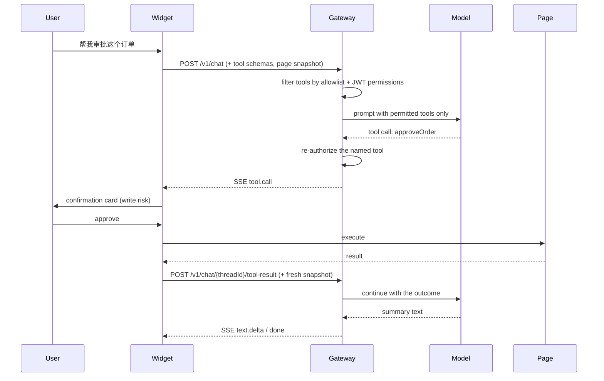

# Page Actions & Tool Calling

How the copilot performs work in your application, and what stops it doing the wrong thing.

Two mechanisms, both available at once:

| | Declarative tools (A) | Page actions (B) |
|---|---|---|
| What it does | Calls a function you registered | Clicks, fills and reads DOM controls |
| Host effort | Register each capability | None beyond enabling it |
| Precision | Exact — you define the contract | Best effort against live DOM |
| Best for | Business operations (approve, export) | Legacy pages, form filling |
| Default | Off until you pass `tools` | Off until `pageActions.enabled` |

Prefer A for anything consequential: the intent is explicit, the arguments are typed, and the server
can require a permission by name. Use B to cover screens you cannot or do not want to instrument.

---

## Risk grading and confirmation

Every tool carries a risk level, which decides whether the user is asked before it runs.

| Risk | Meaning | Confirmation |
|------|---------|--------------|
| `read` | No side effects | Runs immediately |
| `write` | Changes state, submits, navigates | Confirmation card, every call |

A tool with no declared risk is treated as `write`. `confirm: true` / `confirm: false` overrides the
default in either direction.

Built-in page action risks:

| Tool | Risk | Notes |
|------|------|-------|
| `page_read` | `read` | Reads one control's text or value |
| `page_scroll` | `read` | Brings a control into view |
| `page_fill` | `write` | Types into an input; fires `input` + `change` |
| `page_select` | `write` | Chooses a dropdown option |
| `page_click` | `write` | **Never auto-approvable** — a click can submit or navigate |

Form filling one field at a time behind a prompt is unusable, so `page_fill` and `page_select` can be
auto-approved explicitly. That is a deliberate trade, which is why it is opt-in per host:

```js
pageActions: {
  enabled: true,
  autoApprove: ['page_fill', 'page_select'],
}
```

`page_click` is intentionally absent from `autoApprove`.

---

## Registering business tools

```js
Copilot.init({
  appId: 'crm',
  gatewayUrl: 'https://copilot.example.com',
  getAccessToken: () => window.casAccessToken,
  contextProvider: () => ({ orderId: window.orderId, status: window.orderStatus }),

  tools: [
    {
      name: 'approveOrder',
      description: '审批当前订单',
      parameters: {
        type: 'object',
        properties: { orderId: { type: 'string', description: '订单号' } },
        required: ['orderId'],
      },
      risk: 'write',
      execute: async ({ orderId }) => {
        // Throwing is fine: the message is shown to the user and fed back to the model.
        if (orderId !== window.orderId) throw new Error('订单号与当前页面不一致');
        return api.approve(orderId);
      },
    },
  ],

  pageActions: { enabled: true, autoApprove: ['page_fill', 'page_select'] },
  onToolCall: ({ name, args, approved }) => analytics.track('copilot_action', { name, approved }),
});
```

Register later with `Copilot.registerTool(tool)` and remove with `Copilot.unregisterTool(name)`.

### Writing a good tool

- **Name it after the operation**, not the UI (`approveOrder`, not `clickApproveButton`).
- **Describe when to use it**, not how it works — the description is what the model matches against.
- **Validate inside `execute`.** The model can pass anything; treat arguments as untrusted input.
- **Keep it idempotent when you can.** The copilot will not auto-retry a write, but users do.
- **Return the resulting state.** The model uses it to decide whether the goal was met.

---

## How a turn with actions runs



Each tool round-trip is its own request, so no stream is held open across a user decision. The server
caps round-trips per turn (`copilot.tools.max-steps-per-turn`, default 5) and the client caps them
too (`maxToolSteps`).

---

## Security model

Actions turn prompt injection from an accuracy problem into a damage problem. The defenses:

### 1. A tool the model was never offered cannot run

The browser declares what it can execute per turn. The gateway intersects that with its own policy
and advertises only the survivors. A call naming anything else is refused as `tool_not_available` —
that is the shape an injection attempt takes.

### 2. Authorization is server-side, from verified claims

```yaml
copilot:
  tools:
    allowed:
      crm: [approveOrder, exportOrder, page_click, page_fill, page_read]
    required-permission:
      approveOrder: order:approve
```

`allowed` restricts which names an application may use at all. `required-permission` demands a JWT
permission. Both are checked when advertising **and** again before dispatch, so a mid-turn change in
entitlements cannot be exploited. A client claiming a permission means nothing; only the token does.

### 3. Page content can never request an action

The system prompt states that page context is data, that instructions inside it must be ignored, and
that no action may be taken because page content suggested it. Combined with the allowlist, injected
text has no path to a side effect.

### 4. Writes need a human

Write-risk calls show the tool name and the exact arguments before running. Declining returns a
`user_declined` result to the model, which is instructed to stop rather than find another route.

### 5. Elements are re-verified at execution time

A page action targets a control by `ref` from the latest snapshot. Immediately before acting the SDK
re-resolves it and checks it is still attached, visible, enabled, and still carries the same
accessible name. If a re-render changed the control, the action fails with an explanation instead of
clicking whatever now occupies that position.

### 6. Sensitive controls are invisible to actions

Password fields and controls whose name suggests a secret are excluded from the snapshot entirely, so
they cannot be read or filled. `data-copilot-ignore` excludes whole regions.

### 7. Writes are never replayed automatically

Once a turn has performed a write, the SDK disables its retry paths — including the 401 refresh
replay — because re-running the turn could duplicate the side effect.

### 8. Everything is auditable

Tool calls and results are persisted as conversation turns, and each turn produces an audit row with
`traceId`, tenant, user, question and outcome. `onToolCall` gives the host its own hook.

---

## Failure behavior

| Situation | What happens |
|-----------|--------------|
| User declines | `user_declined` returned to the model; action logged as rejected |
| Tool throws | Message returned to the model and shown in the transcript |
| Element gone or relabelled | Action fails with a "page changed" explanation; model can re-observe |
| Tool not permitted | Never advertised; if it slips through, refused with `tool_forbidden` |
| Tool never advertised | Refused with `tool_not_available` |
| Step budget exhausted | Turn stops with `tool_step_limit` instead of looping |

---

## Offline mode

With `COPILOT_MOCK_LLM=true` (the default) a deterministic planner stands in for the model. It
recognises action phrasing, maps "fill X with Y" onto the matching control, matches business tools by
description overlap, and otherwise answers from context. It never chains actions on its own. This
keeps the demo and the E2E suite runnable with no API key — it is not a substitute for a model.

---

## Enabling actions in production

- [ ] Register only the operations you want automated; keep `description` accurate
- [ ] Set `copilot.tools.allowed.<appId>` to that exact list
- [ ] Map every consequential tool in `copilot.tools.required-permission`
- [ ] Leave `page_click` out of `autoApprove`
- [ ] Mark truly destructive tools `confirm: true` even if you auto-approve others
- [ ] Add `data-copilot-ignore` to regions the assistant should never see
- [ ] Verify tool calls appear in `/v1/audits`
- [ ] Decide whether `pageActions` is needed at all — declarative tools alone are safer
