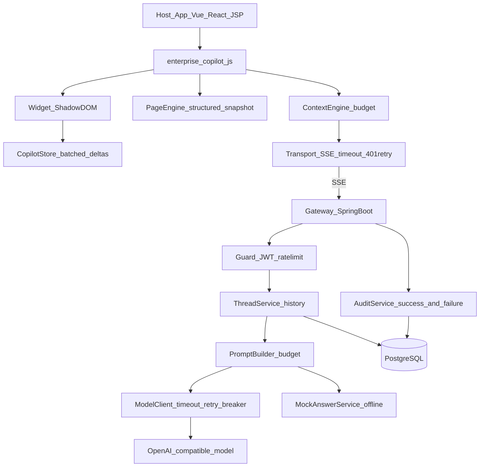
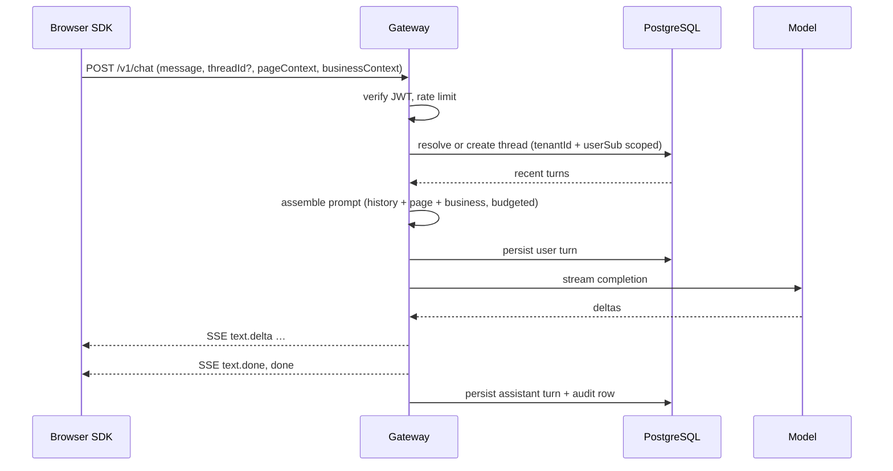

# Enterprise AI Copilot SDK — Architecture

Embeddable AI assistant for business web applications. A host page loads one script:

```html
<script src="enterprise-copilot.js"></script>
```

and gets a bottom-right copilot that understands the current page and the app's business context,
and holds a multi-turn conversation about them.

Scope of V1: **question answering about the current page.** Acting on the page (clicking, filling
forms) and enterprise knowledge retrieval are later phases — see
[design-v1-hardening.md](design-v1-hardening.md).

## Design principles

1. **LLM API keys never enter the browser.** All model traffic goes through `copilot-gateway`.
2. **Identity comes from a verifiable JWT**, never a client-supplied `userId`.
3. **Conversation state lives on the server**, so token budget, auditing and ownership checks cannot
   be bypassed by a client.
4. **Page DOM text is untrusted input** (prompt-injection surface), isolated from system instructions.
5. **Defaults are safe.** Every debug affordance is gated behind the `dev` profile.
6. **Failures are visible and recoverable**, and always audited.
7. **Zero host pollution.** Shadow DOM styling, no global namespace theft, no layout interference.

## Component view



### Module responsibilities

| Module | Responsibility |
|--------|----------------|
| `widget/` | Shadow DOM chat UI: streaming, stop, retry, copy, clear, i18n, a11y |
| `store.ts` | External store; batches streaming deltas so long answers do not thrash React |
| `page/PageEngine` | Structured page extract: headings, fields, tables, controls, selection; redaction |
| `context/ContextEngine` | Merges business context, enforces the 4KB budget, tolerates host bugs |
| `transport/` | SSE client with idle timeout, error taxonomy, thread APIs |
| `auth/` | JWT verification, principal extraction |
| `chat/ThreadService` | Conversation persistence and ownership enforcement |
| `chat/PromptBuilder` | Grounded prompt assembly under a combined character budget |
| `chat/ModelClient` | Model call with timeout, bounded retry, circuit breaker |
| `chat/MockAnswerService` | Deterministic offline answering (business-field retrieval) |
| `ratelimit/` | Per-user and per-tenant fixed-window limits |
| `audit/` | Audit of every turn, successful or failed |

## Conversation model

A turn is not self-contained; the server owns history.



Ownership: a thread belongs to `(tenantId, userSub)`. A mismatch returns **404**, not 403, so thread
ids are not enumerable.

The SDK stores only the `threadId` (in `sessionStorage`) and refetches messages on reload — message
content never needs to be trusted from the client.

## Context model

```ts
interface PageContextSnapshot {
  url: string;
  title: string;
  summary: string;            // structured: HEADINGS / FIELDS / TABLES / ACTIONS / PAGE_TEXT
  actionableElements: Array<{ name: string; role: string; hint?: string }>;
  selection?: string;         // what the user highlighted
}
```

### Budgets

| Field | Limit | Enforced |
|-------|-------|----------|
| `businessContext` | 4 KB | Client trims, server rejects with 413 |
| `pageContext.summary` | 12 000 chars | Client caps, server re-caps |
| `actionableElements` | 40 (viewport-first) | Client and server |
| `message` | 8 000 API / 4 000 prompt | Server |
| Conversation history | 8 turns / 6 000 chars | Server |
| **Total prompt** | 24 000 chars | Server |

Under budget pressure the server sheds context in a deliberate order: **page text first, then
history. Business facts are never dropped** — they are the authoritative answer source.

### Redaction

Removed client-side before upload: password and secret-named inputs, email addresses, phone numbers,
long digit sequences (card-like), `sk-` style keys. Hosts can exclude whole regions with
`data-copilot-ignore`.

## Trust & threat model

| Threat | Mitigation |
|--------|------------|
| Stolen model API key | Keys only on the gateway; the browser holds an app JWT |
| Spoofed identity | Only verified JWT claims are trusted; issuer and expiry checked |
| Weak signing key | Startup fails when the secret is under 32 bytes |
| Prompt injection via DOM | Page context is labeled untrusted data; system prompt forbids following it |
| Cross-tenant / cross-user leakage | Threads scoped to `(tenantId, userSub)`; audit reads filtered by tenant |
| Audit exposure | `/v1/audits` requires a token plus `audit:read` |
| Unauthenticated token minting | Demo endpoint exists only under the `dev` profile |
| Abuse / cost blowout | Per-user and per-tenant rate limits; bounded context and retries |
| Host CSS breakage | Widget renders inside a Shadow DOM |
| Sensitive page content | Client-side redaction plus `data-copilot-ignore` |

Audit fields: `traceId`, `userSub`, `tenantId`, `appId`, `threadId`, `question`, `contextHash`,
`answer`, `model`, `status`, `errorCode`, `latencyMs`, `createdAt`.

## Reliability

| Failure | Behavior |
|---------|----------|
| Model timeout | Aborted at `copilot.llm.timeout`; up to 2 retries **before** the first token |
| Model failure mid-stream | Partial answer kept; no restart (would duplicate text) |
| Repeated model failures | Circuit breaker opens 30s after 5 consecutive failures |
| Any model failure | Degraded message to the user, `error` event, `FAILED` audit row |
| Client disconnect | Upstream streaming stops; partial answer persisted |
| Gateway silence | Client-side idle timeout aborts and offers retry |
| Expired token | Client refetches the token once and replays the turn |
| Rate limit | `429 rate_limited` with a retry hint |

## Open-source landscape

| Project | Role |
|---------|------|
| Alibaba PageAgent | Reference for in-page perception; planned execution runtime for phase 2 |
| CopilotKit / AG-UI | Protocol and Context/Tool design influence |
| Pillar | Closest product shape; we differentiate on identity, tenancy, audit |
| Dify / MaxKB | Candidate RAG backends for phase 3 |

**Differentiation:** business/user context binding, verifiable identity, tenant isolation,
server-side enforcement and audit — not another chat bubble.

## Runtime topology

| Environment | Gateway | Database | Token minting |
|-------------|---------|----------|---------------|
| Local (`dev`) | `mvn spring-boot:run` on `:8080` | H2 file | Enabled (unauthenticated) |
| Production (`prod`) | Container, non-root JRE | PostgreSQL + Flyway | Not registered |

See [operations.md](operations.md) for configuration and the go-live checklist.
