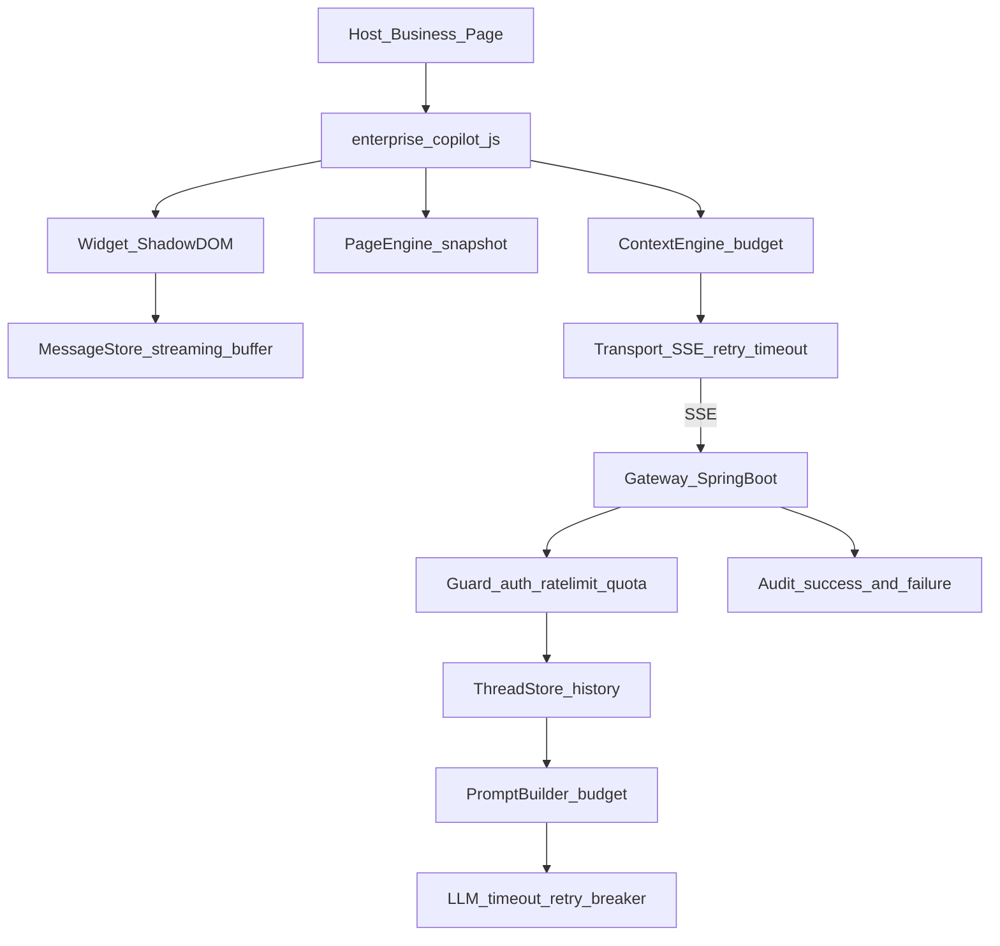

# Enterprise AI Copilot — V1 整体设计（好用 + 可靠）

本文基于对当前代码库的完整审计，定义 **V1 的目标形态、取舍原则与落地范围**。
V1 的产品边界维持既定判断：**针对当前网页做问答**（不做页面自动操作、不做企业知识库）。

- 现状架构：[architecture.md](architecture.md)
- 接口契约：[api.md](api.md)

---

## 一、当前状态的诚实结论

MVP 可以演示，但**不能交付使用**。核心问题不是功能少，而是三类"看起来有、实际没有"：

### 1. 多轮对话在服务端根本不成立（最严重）

UI 显示了一个会话，但模型每次只看到一句话。

| 环节 | 现状 |
|------|------|
| SDK 存了消息列表 | `packages/sdk/src/Copilot.ts` — 仅用于渲染 |
| 请求体只带当前一句 | `packages/sdk/src/context/ContextEngine.ts` — `buildPayload` 无 history |
| Gateway DTO 无历史字段 | `services/copilot-gateway/src/main/java/com/enterprise/copilot/api/dto/ChatDtos.java` |
| Prompt 只拼当前问题 | `services/copilot-gateway/src/main/java/com/enterprise/copilot/chat/PromptBuilder.java` |
| `threadId` 只写审计 | `services/copilot-gateway/src/main/java/com/enterprise/copilot/chat/ChatService.java` |

后果：用户问"那金额呢？"必然失败。这是**产品级缺陷**，不是优化项。

### 2. 声明了但没实现的 API（假承诺）

对接方会照着类型定义写代码，然后发现无效：

| API | 声明位置 | 实际 |
|-----|----------|------|
| `init.tools` / `CopilotTool` | `packages/sdk/src/types.ts` | 从未被读取 |
| `ui.locale` | `packages/sdk/src/types.ts` | 从未被读取，文案硬编码中文 |
| `ui.position` | `packages/sdk/src/types.ts` | CSS 固定 bottom-right |
| `clientTools` 请求字段 | `ChatDtos.java` | 接收后丢弃 |
| `package.json` 的 `main`/`module`/`types` | `packages/sdk/package.json` | **三个路径全部不存在**（`umd.cjs` 未构建、`module` 指向 IIFE、无 `.d.ts`） |

### 3. 生产安全默认值是危险的

| 项 | 现状 | 风险 |
|----|------|------|
| `/v1/demo/token` | 免鉴权 + **默认开启** | 任何人可签发任意 `sub`/`tenantId`/`permissions` 的 JWT |
| `/v1/demo/audits` | 免鉴权 | 跨租户泄露全部问答内容 |
| H2 Console `/h2` | 默认开启、无口令 | 直接访问数据库 |
| CORS | `cors-allow-all-patterns` **默认 true** | 任意站点可调用 |
| JWT 密钥 | 弱默认值写在 `application.yml`，短密钥自动补零而非拒绝 | 可伪造 Token |

### 4. 其它显著短板

- **流式渲染抖动**：每个 SSE delta 都触发整树 `root.render()` + Markdown 重解析（`packages/sdk/src/widget/mount.tsx`）
- **无法停止生成**：`AbortController` 只在 `destroy()` 用，无 UI、无公开 API
- **失败即死路**：错误被塞进气泡文本，无重试、无 401 刷新 Token
- **模型调用无护栏**：无超时、无重试、无熔断；LLM 失败的请求**连审计都没有**
- **测试近乎为零**：后端 2 个单测，前端 0 个；无 CI、无 Dockerfile
- **Mock LLM 只认「按钮」「状态」两个关键词**，其它问题走复述式兜底（用户已实际踩到"金额"问题）

---

## 二、V1 设计原则

1. **契约诚实**：能力要么实现，要么从 API 与文档中删除。不留死配置。
2. **上下文在服务端收敛**：会话历史、预算、截断策略由 Gateway 掌握，SDK 只上报页面与业务事实。
3. **默认安全**：所有 demo/调试入口默认关闭，由显式 profile 打开。
4. **失败可见可恢复**：任何失败都有明确文案 + 重试路径 + 审计记录。
5. **宿主零污染**：Shadow DOM 隔离、不抢全局、不阻塞宿主渲染。

---

## 三、V1 目标架构



相较现状的关键变化：**新增 ThreadStore（会话历史）、Guard（限流配额）、LLM 护栏、流式缓冲**。

---

## 四、V1 范围拆解

### A. 对话内核（P0，决定"能不能用"）

#### A1. 多轮对话（服务端会话）

**方案：服务端存储 + `threadId` 续接**（而非客户端上传全量历史）。
理由：Token 预算、审计完整性、防止客户端伪造历史。

新增实体与接口：

```java
// services/copilot-gateway/.../chat/ChatThread.java
@Entity class ChatThread { id, threadId, tenantId, userSub, appId, title, createdAt, lastActiveAt }

// services/copilot-gateway/.../chat/ChatMessage.java
@Entity class ChatMessage { id, threadId, role /* user|assistant */, content, tokenEstimate, createdAt }
```

`POST /v1/chat` 行为变更：

1. 有 `threadId` → 校验 **归属**（`tenantId` + `userSub` 必须匹配，否则 404，防越权）
2. 载入最近 N 轮（默认 `history-max-turns: 8`），按预算从旧到新裁剪
3. 拼进 Prompt（`PromptBuilder` 增加 `history` 参数）
4. 本轮 user / assistant 消息落库

新增接口：

| 方法 | 路径 | 说明 |
|------|------|------|
| GET | `/v1/threads/{threadId}/messages` | 恢复会话（刷新页面后） |
| DELETE | `/v1/threads/{threadId}` | 清空会话 |

SDK 侧：`threadId` 存 `sessionStorage`，`init` 时尝试恢复。

#### A2. 停止生成

- `sseClient` 支持外部 abort
- `Copilot.stop()` 公开方法
- Widget 在 `streaming` 时把"发送"变为"停止"
- 中断后保留已生成内容并标注"已停止"

#### A3. 重试与 401 自愈

- 传输层区分 **可重试**（网络/超时/502）与 **不可重试**（400/413）
- 401 → 调一次 `getAccessToken()` 强制刷新后重放，仍失败才报错
- 失败气泡带"重新生成"按钮，重放最后一轮 user 消息

#### A4. 流式渲染性能

- 引入订阅式 store（`useSyncExternalStore`），delta 只更新最后一条
- delta 合批（约 50ms 或按字数）后再 render
- 流式期间用纯文本渲染，`text.done` 后再走 Markdown，避免半截语法解析抖动

---

### B. 契约诚实化（P0，一次性清账）

| 项 | V1 处置 |
|----|---------|
| `init.tools` / `CopilotTool` | **从 V1 类型中移除**，移入 `types-next.ts` 或直接删除，Phase 2 再引入 |
| `clientTools` 请求字段 | Gateway DTO 保留但文档标注"预留，当前忽略"，或一并移除 |
| `ui.locale` | **实现**：内置 `zh-CN` / `en-US` 文案表，所有硬编码文案（含错误提示）走 `t(key)` |
| `ui.position` | **实现**：支持 `bottom-right` / `bottom-left`，CSS 变量驱动 |
| `ui` 扩展 | 新增 `primaryColor`、`logoUrl`、`zIndex`、`launcherText`，全部落到 CSS 变量 |
| `package.json` 导出 | 修正为实际产物：`enterprise-copilot.esm.js` / `enterprise-copilot.js`，接入 `vite-plugin-dts` 产出 `.d.ts` |
| `api.md` 的 `502 model_error` | 统一为 **SSE `error` 事件 + HTTP 200**（流已开启无法改状态码），文档同步修正 |
| `threadId` 语义 | 文档明确"服务端会话标识，可续接"（A1 实现后成立） |

---

### C. 可靠性与安全基线（P0/P1）

#### C1. 默认安全（P0）

- 新增 `application-prod.yml`，**prod 下强制**：`demo-token-enabled: false`、`h2.console.enabled: false`、`cors-allow-all-patterns: false`
- `/v1/demo/**` 整体挪到 `dev` profile 下才注册（`@Profile("dev")`）
- JWT 密钥：**短于 32 字节直接启动失败**（不再补零）；prod 无 `COPILOT_JWT_SECRET` 时拒绝启动
- 解析时校验 `issuer`，区分"过期 / 签名错误 / 格式错误"三类 401 文案
- 审计查询接口改为需鉴权 + **强制按 `tenantId` 过滤**

#### C2. 请求护栏（P1）

- **限流**：按 `tenantId` + `userSub` 令牌桶（`copilot.rate-limit.per-user-per-minute`），超限返回 429
- **服务端字段上限**：`message`、`url`、`title`、元素名统一截断，避免绕过客户端预算
- **总 Prompt 预算**：页面 + 业务 + 历史合并计算，超限时按优先级丢弃（历史 → 页面正文 → 业务字段永不丢）

#### C3. 模型调用护栏（P1）

- 连接/读取超时（`copilot.llm.timeout: 30s`）
- 可重试错误重试 2 次（指数退避）
- 熔断（Resilience4j），熔断期间直接返回友好降级文案
- **失败也写审计**：`status=failed` + `errorCode`
- SSE `onTimeout` / `onCompletion` / `onError` 全部挂钩，客户端断开时取消上游流

#### C4. Mock LLM 可用化（P1）

现状只认「按钮」「状态」。V1 改为**基于上下文的规则检索**：

- 从 `businessContext` 做键名/别名匹配（金额→`amount`、客户→`customerName`、状态→`status`…）
- 命中则回答具体值；未命中则从页面摘要做关键词片段召回
- 都没有 → 明确回答"页面与上下文中没有相关信息"（而非复述问题）

目标：**离线 Demo 也能正确回答"金额是多少"**。

---

### D. PageEngine 质量（P1）

| 项 | V1 改进 |
|----|---------|
| 结构化提取 | 表格 → Markdown 表；表单 → `label: value` 对；定义列表同理 |
| 选区感知 | 用户选中文本时随请求上报 `selection`，答案优先围绕选区 |
| 可见性权重 | 视口内元素优先，折叠/隐藏内容降权 |
| 忽略区域 | 支持 `data-copilot-ignore` 属性跳过敏感/噪音区块 |
| 脱敏增强 | 邮箱、手机号、卡号、`sk-` 类密钥模式一并遮蔽 |
| 预算 | 字符数改为 **token 估算**（约 `len/1.6` 中文近似），与 Gateway 预算对齐 |
| 性能 | `MutationObserver` 只观测 `main` 容器；快照复用未变更区块 |

---

### E. 体验与可访问性（P1）

- 打字指示器（`data-streaming` 目前是死属性，需补 CSS）
- 复制答案、清空会话、会话恢复
- `Escape` 关闭、焦点陷阱、关闭后焦点回到启动按钮、`aria-live` 播报流式内容、`aria-modal`
- 移动端全屏模式 + `env(safe-area-inset-*)`
- 空状态与错误状态文案随 `locale`

---

### F. 工程基建（P1）

| 项 | 内容 |
|----|------|
| 前端测试 | Vitest：`sseClient` 解析（含 CRLF/半包/error 事件）、`ContextEngine` 预算、`PageEngine`（jsdom）；Testing Library：Widget 交互与 a11y |
| 端到端 | Playwright：打开面板 → 提问 → 流式回答 → 停止 → 重试 → 刷新恢复 |
| 后端测试 | MockMvc：SSE 事件序列、鉴权矩阵（缺失/过期/篡改）、CORS 预检、413、429、租户越权 404；`@DataJpaTest` 覆盖 Thread/Message/Audit |
| CI | GitHub Actions：`typecheck + lint + test + build`（前端）、`mvn verify`（后端），PR 必过 |
| Lint | ESLint + TypeScript 规则；Java 侧 Spotless（google-java-format） |
| 打包 | React 转 `peerDependencies` 可选方案评估；产出体积预算门禁（IIFE gzip < 120KB）；`.d.ts` 产出 |
| 部署 | `Dockerfile`（分层构建）+ `docker-compose.yml`（gateway + postgres），prod profile 走 Postgres |
| 数据库 | Postgres 驱动 + Flyway 迁移，去掉 `ddl-auto: update`；`audit_records` 补 `tenantId`/`traceId`/`createdAt` 索引 |
| 可观测 | Actuator（liveness/readiness/metrics）、MDC 注入 `traceId` 到所有日志 |

---

## 五、实施顺序

严格按"先能用、再可靠、后好用"推进，每步可独立验证。

### 第 1 步：修复假承诺与安全默认值（无行为风险，先清账）

1. 修正 `packages/sdk/package.json` 导出 + 接 `vite-plugin-dts`
2. 删除 `tools` / `CopilotTool` 死类型；实现 `locale`、`position`
3. `@Profile("dev")` 隔离 `/v1/demo/**`；新增 `application-prod.yml`；JWT 弱密钥拒绝启动
4. 审计接口加鉴权 + 租户过滤
5. `api.md` 同步 `model_error` 语义

### 第 2 步：对话内核（决定可用性）

6. `ChatThread` / `ChatMessage` 实体 + Flyway 迁移
7. `/v1/chat` 载入并拼接历史（含归属校验、预算裁剪）
8. `GET/DELETE /v1/threads/{threadId}`；SDK 会话恢复
9. `Copilot.stop()` + Widget 停止按钮
10. 重试 + 401 自愈 + 超时

### 第 3 步：可靠性护栏

11. 模型超时/重试/熔断 + 失败审计
12. 限流与服务端字段上限 + 总 Prompt 预算
13. SSE 生命周期回调与上游取消
14. Mock LLM 上下文检索改造

### 第 4 步：体验与性能

15. 流式渲染 store 化 + delta 合批
16. 打字指示器、复制、清空、a11y、移动端
17. PageEngine 结构化提取 + 选区 + 忽略区域 + 脱敏增强

### 第 5 步：工程化收口

18. Vitest + Testing Library + Playwright
19. 后端集成测试矩阵
20. CI + ESLint + Spotless + 体积门禁
21. Dockerfile + compose + Postgres + Actuator + MDC

---

## 六、V1 验收标准

功能：

- [ ] 连续追问成立："订单金额是多少" → "那客户是谁" 能正确接上上下文
- [ ] 刷新页面后会话可恢复；可清空会话
- [ ] 生成中可停止，停止后内容保留并标注
- [ ] 网络中断/401 可自动或一键重试成功
- [ ] Mock 模式下能答出金额、客户、状态等业务字段
- [ ] 中英文界面随 `ui.locale` 切换；主色与位置可配置

可靠性：

- [ ] LLM 超时/失败有友好降级文案，且审计留痕
- [ ] 超出限流返回 429，不影响其他租户
- [ ] 跨租户访问他人 `threadId` 返回 404
- [ ] prod profile 下 demo 接口、H2 控制台不可访问，CORS 收紧
- [ ] 长回答（>2000 字）流式渲染无明显卡顿

工程：

- [ ] 前后端 CI 全绿；关键路径有测试覆盖
- [ ] `docker compose up` 可起完整环境（gateway + postgres）
- [ ] SDK 有 `.d.ts`，`npm pack` 内容正确，IIFE gzip 体积在门禁内

---

## 七、明确不做（V1 边界）

保持 V1 聚焦"当前网页问答"：

- 页面自动操作（点击/填表）与 Tool Calling → Phase 2
- PageAgent 执行环、HITL 确认 → Phase 2
- 企业知识库 / RAG / 引用来源 → Phase 3
- 真实 CAS JWKS、管理后台、MCP、Agent 编排 → Phase 3
- 跨页/跨 iframe/深层 Shadow DOM 感知 → 视需求再评估
